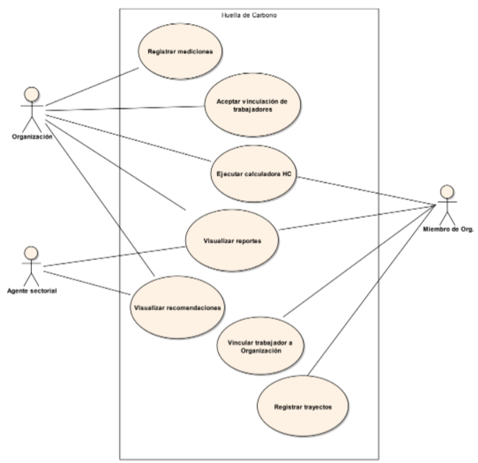

# Mi impacto ambiental

La consigna completa de la primera iteración se encuentra [aquí](https://docs.google.com/document/d/1VjI_qd5L2GGb6oY8Ti2PxEbFEMvMN1yOcK_0mYn59Tg/edit).
----------

**Nuestro Sistema**

En el contexto de suma importancia del cambio climático y asumiendo un compromiso con la reducción de la huella de 
carbono, diseñaremos y desarrollaremos un Sistema, de alcance Nacional, que permita el seguimiento del impacto de HC de
todas las Organizaciones con y sin fines de lucro, y de todas las Entidades Gubernamentales. La finalidad de este 
Sistema es lograr que cada una de las Organizaciones, sus miembros, Departamentos y Provincias, tomen conciencia del 
impacto que están causando en el cambio climático y propicien una reducción de la HC. Para lograr esto, el Sistema
tomará, por cada Organización, distintas mediciones que tengan impacto en el indicador que nos interesa, calculará 
el nivel de HC y enviará recomendaciones y sugerencias generales a los diferentes interesados.
El Sistema deberá contar, mínimamente, con las siguientes funcionalidades de alto nivel:
- Calculadora de HC a nivel Organizacional
- Mi impacto de HC personal en las Organizaciones
- HC departamental y provincial
- Reportes de seguimiento

El equipo que trabajó hasta el momento en el proyecto nos envió un diagrama general de Casos de Uso inicial:

  

## Primer entrega: Modelado de Objetos Parte 1

**Alcance:**
- Organizaciones y Miembros
- Registro de trayectos (básico) para los Miembros
- Registro para la autenticación de usuario Administrador

**Dominio:**
En esta primera iteración trabajaremos con la definición de las Organizaciones y sus miembros, así como también sobre el Registro de trayectos que realizan estos últimos y el Registro para la autenticación de usuario Administrador.

**Organizaciones y Miembros:**
De las Organizaciones interesa conocer su Razón Social, su tipo (Gubernamental, ONG, Empresa, Institución), su ubicación geográfica, los sectores o áreas que la componen y sus miembros. Además, es necesario conocer la clasificación de la Organización (Ministerio, Universidad, Escuela, Empresa del sector primario, Empresa del sector secundario, etc.).
De cada miembro de una Organización interesa su nombre, apellido, tipo y número de documento y las Organizaciones en las cuales trabaja, detallando por cada una el área al que pertenece.

**Registro de Trayectos:**
Un miembro puede ser parte de más de una Organización. El mismo debe registrar en el Sistema, semestralmente o cada vez que existan cambios significativos, los trayectos que realiza para poder llegar (y regresar) hasta las Organizaciones en las cuales trabaja. Es necesario considerar que si la persona pertenece a más de una Organización, puede comenzar el recorrido desde su punto de partida (su hogar, por ejemplo), luego dirigirse a la primera Organización; desde allí dirigirse a la segunda; y así sucesivamente. 
Además, es necesario detallar el medio de transporte utilizado en cada tramo, los cuales pueden ser: vehículo particular, transporte público (tren, subte, colectivo), servicio de transporte contratado (taxis, remises, etc.), bicicleta (y similares, como monopatín) o a pie:
- Si el medio de transporte es vehículo particular, se debe especificar el tipo de vehículo (moto, auto o camioneta) y el tipo de combustible utilizado (GNC, Nafta, Eléctrico o Gasoil).
- Si el medio de transporte es público debe especificarse cuál de ellos es el involucrado y detallar las paradas de inicio y fin del tramo, además de la línea utilizada.
- Si el medio de transporte es un servicio contratado debe especificarse cuál de ellos es el involucrado.
- Si el medio de transporte es bicicleta (o similares) o a pie, no es necesario brindar ningún detalle extra.

Para los casos de vehículo particular, servicio contratado y bicicleta/pie, debe especificarse una dirección de inicio y una dirección de llegada.
Cabe destacar que un trayecto, considerado como un viaje del punto A al punto B, puede contener muchos tramos intermedios.

**Registro para el Administrador:**
Los administradores de la plataforma serán los encargados de configurar los parámetros generales, tales como los valores de Factores de Emisión (FE) y demás configuraciones requeridas para el correcto funcionamiento.

### Requerimientos detallados
Para esta entrega se deberán satisfacer los siguientes requerimientos:

*Requerimientos generales*
1. Se debe permitir el alta de Organizaciones y de sectores dentro de cada una de éstas.
2. Se debe permitir que un Miembro se vincule con un sector de la organización. Las Organizaciones deben aceptar esta vinculación para que las mediciones brindadas por dicho miembro (como los trayectos) tengan impacto en la Organización. 
3. Se debe permitir el alta de trayectos teniendo en cuenta que cada uno de éstos puede contener varios tramos.
4. Se debe permitir el alta de nuevas líneas férreas, subterráneas y de colectivos; así como también el alta de paradas/estaciones de cada una de ellas.
5. Se debe permitir el alta de nuevos servicios de transporte contratados.

*Requerimientos de seguridad*

6. Registrar administradores
7. Por el momento, sólo se requiere guardar usuario y contraseña.
8. Siguiendo las recomendaciones del OWASP (Proyecto Abierto de Seguridad en Aplicaciones Web), que se ha constituido en un estándar de facto para la seguridad, se pide:
9. No utilice credenciales por defecto en su software, particularmente en el caso de administradores. 
10. Implemente controles contra contraseñas débiles. Cuando el usuario ingrese una nueva clave, la misma puede verificarse contra la lista del Top 10.000 de peores contraseñas.
11. Alinear la política de longitud, complejidad y rotación de contraseñas con las recomendaciones de la Sección 5.1.1 para Secretos Memorizados de la Guía NIST 800-63.

*Entregables requeridos*
- Modelo de Objetos: diagrama de clases inicial e implementación de los requerimientos de esta entrega.
- Implementación de un algoritmo validador de contraseñas.
