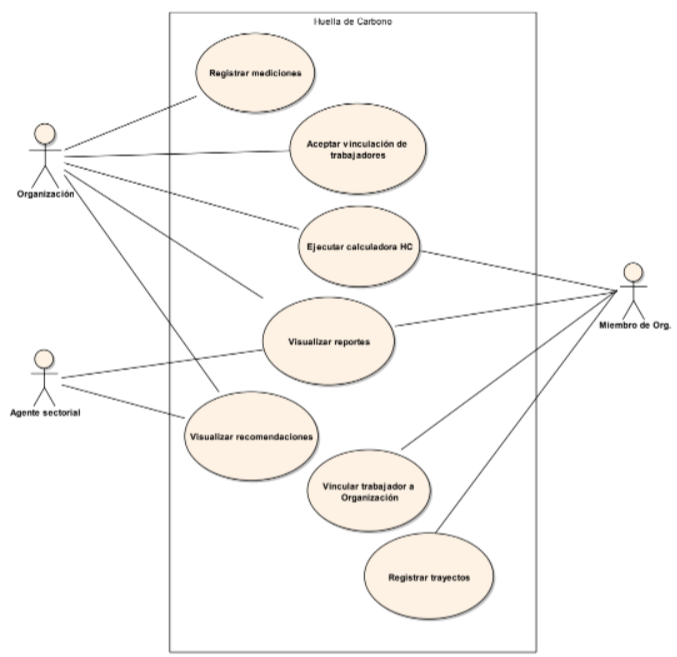

# Mi impacto ambiental

----------

**Nuestro Sistema**

En el contexto de suma importancia del cambio climático y asumiendo un compromiso con la reducción de la huella de
carbono, diseñaremos y desarrollaremos un Sistema, de alcance Nacional, que permita el seguimiento del impacto de HC de
todas las Organizaciones con y sin fines de lucro, y de todas las Entidades Gubernamentales. La finalidad de este
Sistema es lograr que cada una de las Organizaciones, sus miembros, Departamentos y Provincias, tomen conciencia del
impacto que están causando en el cambio climático y propicien una reducción de la HC. Para lograr esto, el Sistema
tomará, por cada Organización, distintas mediciones que tengan impacto en el indicador que nos interesa, calculará
el nivel de HC y enviará recomendaciones y sugerencias generales a los diferentes interesados.
El Sistema deberá contar, mínimamente, con las siguientes funcionalidades de alto nivel:

- Calculadora de HC a nivel Organizacional
- Mi impacto de HC personal en las Organizaciones
- HC departamental y provincial
- Reportes de seguimiento

El equipo que trabajó hasta el momento en el proyecto nos envió un diagrama general de Casos de Uso inicial:

  

## Primer entrega: Modelado de Objetos Parte 1

La consigna completa de la primera iteración se
encuentra [aquí](https://docs.google.com/document/d/1VjI_qd5L2GGb6oY8Ti2PxEbFEMvMN1yOcK_0mYn59Tg/edit).

**Alcance:**

- Organizaciones y Miembros
- Registro de trayectos (básico) para los Miembros
- Registro para la autenticación de usuario Administrador

**Dominio:**
En esta primera iteración trabajaremos con la definición de las Organizaciones y sus miembros, así como también sobre
el Registro de trayectos que realizan estos últimos y el Registro para la autenticación de usuario Administrador.

**Organizaciones y Miembros:**
De las Organizaciones interesa conocer su Razón Social, su tipoOrganizacion (Gubernamental, ONG, Empresa, Institución), su ubicación
geográfica, los sectores o áreas que la componen y sus miembros. Además, es necesario conocer la clasificación de la
Organización (Ministerio, Universidad, Escuela, Empresa del sector primario, Empresa del sector secundario, etc.).
De cada miembro de una Organización interesa su nombre, apellido, tipo y número de documento y las Organizaciones en
las cuales trabaja, detallando por cada una el área al que pertenece.

**Registro de Trayectos:**
Un miembro puede ser parte de más de una Organización. El mismo debe registrar en el Sistema, semestralmente o cada vez
que existan cambios significativos, los trayectos que realiza para poder llegar (y regresar) hasta las Organizaciones
en las cuales trabaja. Es necesario considerar que si la persona pertenece a más de una Organización, puede comenzar el
recorrido desde su punto de partida (su hogar, por ejemplo), luego dirigirse a la primera Organización; desde allí
dirigirse a la segunda; y así sucesivamente.
Además, es necesario detallar el medio de transporte utilizado en cada tramo, los cuales pueden ser: vehículo
particular, transporte público (tren, subte, colectivo), servicio de transporte contratado (taxis, remises, etc.),
bicicleta (y similares, como monopatín) o a pie:

- Si el medio de transporte es vehículo particular, se debe especificar el tipo de vehículo (moto, auto o camioneta) y
  el tipo de combustible utilizado (GNC, Nafta, Eléctrico o Gasoil).
- Si el medio de transporte es público debe especificarse cuál de ellos es el involucrado y detallar las paradas de
  inicio y fin del tramo, además de la línea utilizada.
- Si el medio de transporte es un servicio contratado debe especificarse cuál de ellos es el involucrado.
- Si el medio de transporte es bicicleta (o similares) o a pie, no es necesario brindar ningún detalle extra.

Para los casos de vehículo particular, servicio contratado y bicicleta/pie, debe especificarse una dirección de inicio
y una dirección de llegada.
Cabe destacar que un trayecto, considerado como un viaje del punto A al punto B, puede contener muchos tramos
intermedios.

**Registro para el Administrador:**
Los administradores de la plataforma serán los encargados de configurar los parámetros generales, tales como los
valores de Factores de Emisión (FE) y demás configuraciones requeridas para el correcto funcionamiento.

### Requerimientos detallados

Para esta entrega se deberán satisfacer los siguientes requerimientos:

*Requerimientos generales*

1. Se debe permitir el alta de Organizaciones y de sectores dentro de cada una de éstas.
2. Se debe permitir que un Miembro se vincule con un sector de la organización. Las Organizaciones deben aceptar esta
   vinculación para que las mediciones brindadas por dicho miembro (como los trayectos) tengan impacto en la
   Organización.
3. Se debe permitir el alta de trayectos teniendo en cuenta que cada uno de éstos puede contener varios tramos.
4. Se debe permitir el alta de nuevas líneas férreas, subterráneas y de colectivos; así como también el alta de
   paradas/estaciones de cada una de ellas.
5. Se debe permitir el alta de nuevos servicios de transporte contratados.

*Requerimientos de seguridad*

6. Registrar administradores
7. Por el momento, sólo se requiere guardar usuario y contraseña.
8. Siguiendo las recomendaciones del OWASP (Proyecto Abierto de Seguridad en Aplicaciones Web), que se ha constituido
   en un estándar de facto para la seguridad, se pide:
9. No utilice credenciales por defecto en su software, particularmente en el caso de administradores.
10. Implemente controles contra contraseñas débiles. Cuando el usuario ingrese una nueva clave, la misma puede
    verificarse contra la lista del Top 10.000 de peores contraseñas.
11. Alinear la política de longitud, complejidad y rotación de contraseñas con las recomendaciones de la Sección
    5.1.1 para Secretos Memorizados de la Guía NIST 800-63.

*Entregables requeridos*

- Modelo de Objetos: diagrama de clases inicial e implementación de los requerimientos de esta entrega.
- Implementación de un algoritmo validador de contraseñas.

## Segunda entrega: Modelado de Objetos Parte 2 e Integración

La consigna completa de la segunda iteración se
encuentra [aquí](https://docs.google.com/document/d/1PQjxMl-lHBoFaaaJZFOJodAfxpouqy1qjaPf0D1kAZc/edit)

**Alcance**

- Registro de trayectos (avanzado) para los Miembros de las Organizaciones
- Cálculo de distancia entre tramos
- Carga de mediciones de Organizaciones

**Dominio**
En esta segunda iteración nos encargaremos de refinar el registro de los trayectos que realizan los miembros hasta sus
organizaciones, además de trabajar sobre el cálculo de la distancia entre tramos y la carga de mediciones de las
Organizaciones.

*Registro de Trayectos*
Considerando únicamente los trayectos cuyo medio de transporte sean de vehículo particular o de servicio contratado, se
debe tener en cuenta que los mismos pueden ser compartidos entre trabajadores de la misma Organización.

*Cálculo de distancia entre tramos*
Para calcular la distancia entre los distintos tramos que conforman un trayecto se debe tener en cuenta que:

- Si el medio de transporte es vehículo particular, servicio contratado o bicicleta/pie, entonces la distancia entre el
  punto de inicio y el punto de llegada debe ser calculado utilizando un Servicio Externo.
- Si el medio de transporte es público entonces cada parada/estación debe conocer cuál es su distancia a la próxima. Es
  necesario tener en cuenta que no siempre los transportes públicos realizan los mismos recorridos a la ida y a la
  vuelta. La información de las paradas debe poder ser precargada por un operador del sistema y luego utilizada por
  cualquier usuario, sin importar su organización.

*Carga de mediciones de Organizaciones*
Para poder medir correctamente la HC de cada una de las Organizaciones es necesario conocer los Datos de las
Actividades (DA). Por este motivo, las Organizaciones deben cargar en el Sistema un archivo de CSV, como esta en el
ejemplo.

Tener en cuenta que para cada tipo de consumo se debe poder cargar un factor de emisión de carbono (FE), cuya unidad de
medida debe coincidir, para poder luego calcular la huella de carbono.

**Requerimientos detallados**
Para esta entrega deberán satisfacerse los siguientes requerimientos:

1. Se debe permitir la carga de Trayectos compartidos entre miembros de una organización.
2. Se debe permitir dar a conocer la distancia total de un trayecto, así como también la distancia entre sus puntos
   intermedios en el caso de que éstos existan.
3. Se debe permitir la carga de mediciones por parte de una Organización, respetando la estructura del archivo
   mencionada. Tener en cuenta que los consumos deben estar asociados a un Tipo de Consumo existente.
4. Al cargar los Factores de Emisión (FE, entrega anterior), se debe validar que sus unidades coincidan con las del Tipo
   de Consumo (TC) asociado.

**Entregables requeridos**

- Modelo de Objetos: diagrama de clases que contemple las funcionalidades requeridas.
- Implementación de requerimientos de esta entrega.

## Tercera entrega: Modelado en Objetos parte III

La consigna completa de la segunda iteración se
encuentra [aquí](https://docs.google.com/document/d/1PjtfCoAExroNMmW5SJcM2wR0wzjPC5SxQ995iX0_noQ/edit#)

**Alcance**
- Cálculo de Huella de Carbono
- Agentes sectoriales
- Envío de sugerencias y notificaciones

**Dominio**
En esta tercera iteración nos encargaremos de diseñar y desarrollar el cálculo de la Huella de Carbono. Además, también trabajaremos sobre el envío de sugerencias y notificaciones a las distintas Organizaciones que se encuentren dadas de alta en la plataforma.

*Cálculo de Huella de Carbono*

Teniendo en cuenta el cálculo detallado en la sección de introducción, donde se explica que:

> Huella de carbono(actividad) = Dato Actividad (DA) x Factor Emisión (FE) 

Es importante prestar atención a las unidades de medición de los datos recopilados y su congruencia con los FE para evitar posibles errores en el cálculo.

Los resultados pueden ser expresados en gramo equivalente carbono – gCO2eq, o sus múltiplos, kilogramo equivalente de carbono – kgCO2eq o tonelada equivalente – tnCO2eq.

Para realizar el cálculo se debe tener en cuenta que los valores de los FE (dependientes del tipo de consumo) pueden variar, por lo que se debe posibilitar su edición. La tabla de “Actividades y tipos de consumo a considerar” de la Entrega 2 puede servir a modo orientación.

Tomando como base esta ecuación, necesitamos calcular la HC total de cada una de las Organizaciones, de forma mensual y anual, que estén dadas de alta en el Sistema:

> HCtotal= HCactividades

Por otra parte, es necesario considerar la actividad de “Traslado de Miembros de la Organización”, perteneciente al Alcance n°3. Para ello se deberá tomar como DA los datos de los trayectos ingresados por los miembros de las Organizaciones, teniendo en cuenta que si los trayectos fueron compartidos entre personas de la misma Organización no debe sumarse dos veces el valor de la HC implicada. 

También es necesario considerar que la cantidad de combustible consumido por km, en cada trayecto, depende del medio de transporte. Esta información no ha sido contemplada previamente y deberá ser incorporada. 

*Agentes sectoriales*
Los agentes sectoriales son personas que velan por propiciar una reducción gradual de la HC total del sector territorial al cual pertenecen. 

Cada agente pertenece a un solo sector territorial, los cuales pueden ser Departamentos (o Municipios) o Provincias.

Se debe considerar que la HC total de un sector territorial es el resultado de la sumatoria de las HC totales de cada Organización que se encuentre dentro de ese sector.

*Sugerencias y Notificaciones*

Como plan de concientización a nivel Nacional, se le debe enviar, cada cierto periodo, una guía de Recomendaciones a todas las Organizaciones. La guía de Recomendaciones debe ser una página web estática, ubicada dentro del Sitio donde estará alojado nuestro Sistema.

El envío de esta guía debe realizarse por email y WhatsApp a los contactos definidos por la organización.

*Requerimientos detallados*
1. Se debe permitir ejecutar el cálculo de HC a cada una de las Organizaciones y a cada uno de los Miembros de ellas. En este último caso, debe mostrarse el resultado personal y el impacto que éste genera sobre el total de la organización.
2. Se debe permitir la visualización de un indicador de HC / Cantidad de miembros por cada uno de los sectores/áreas de las organizaciones.
3. Se debe permitir el cambio de los valores de FE con facilidad.
4. Se debe permitir la carga de contactos de la organización para recibir las notificaciones.
5. El Sistema debe enviar el link a la guía de recomendaciones a los contactos de las organizaciones por email y WhatsApp. Tener en cuenta que en el futuro los medios de comunicación podrían cambiar.
6. Se debe configurar una tarea calendarizada, que se encargue del envío de las notificaciones.
7. Se debe permitir la creación de sectores para su gestión de los agentes sectoriales.
ada una de las Organizaciones y a cada uno de los Miembros de ellas. En este último caso, debe mostrarse el resultado personal y el impacto que éste genera sobre el total de la organización.
2. Se debe permitir la visualización de un indicador de HC / Cantidad de miembros por cada uno de los sectores/áreas de las organizaciones.
3. Se debe permitir el cambio de los valores de FE con facilidad.
4. Se debe permitir la carga de contactos de la organización para recibir las notificaciones.
5. El Sistema debe enviar el link a la guía de recomendaciones a los contactos de las organizaciones por email y WhatsApp. Tener en cuenta que en el futuro los medios de comunicación podrían cambiar.
6. Se debe configurar una tarea calendarizada, que se encargue del envío de las notificaciones.
7. Se debe permitir la creación de sectores para su gestión de los agentes sectoriales.

**Entregables requeridos**

- Modelo de Objetos: diagrama de clases que contemple las funcionalidades requeridas.
- Implementación de requerimientos de esta entrega.
